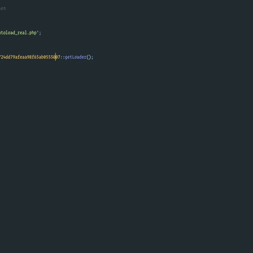

# PHP Documentation Search Workflow for Alfred

Would you like to use [Alfred](https://www.alfredapp.com/) for MacOS to quickly search the PHP documentation?

Well, this Workflow will allow just that, super easy to install and start using. Guaranteed it will improve
your productivity as you can just use your hotkey for [Alfred](https://www.alfredapp.com/) and quick look at the function you're wanting to check out.



Inspired by [Laravel Docs Search](https://github.com/tillkruss/alfred-laravel-docs) by Till Krüss

## Installation

1. [Download the latest version](https://github.com/billrobclark/alfred-phpdoc-search/releases/download/v1.0.1/PHP.Docs.alfredworkflow)
2. Install the workflow by double-clicking and opening the `.alfredworkflow` file that you just downloaded.
3. You can add the workflow to a category, then click "Import" to finish importing.
4. You'll now see the workflow listed there on the left sidebar of your Alfred Workflows preferences.

## Usage

Just type `php` with a space and your search query and results display instantly.

```
php <query>
php array_unique
```

You can press `⌘Y` to Quick Look the result, or you can press `<enter>` to open the
PHP documentation page in your default web browser.